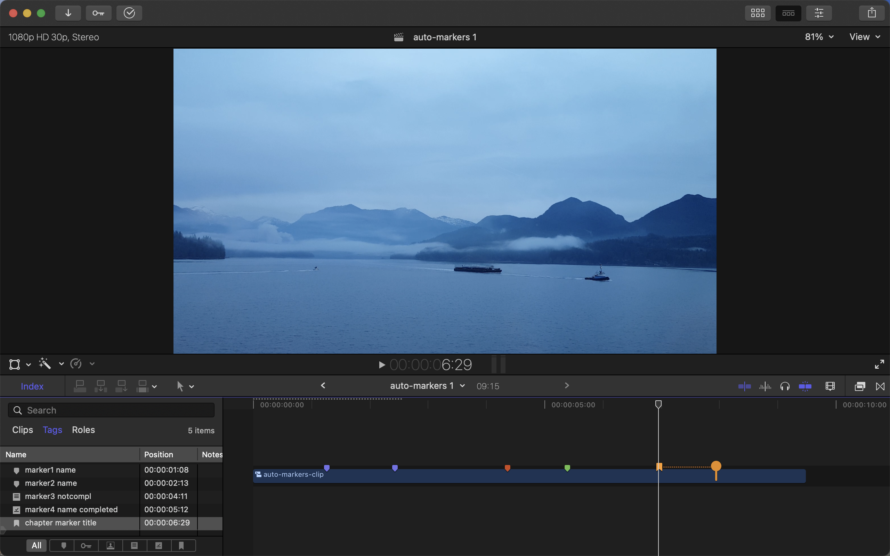
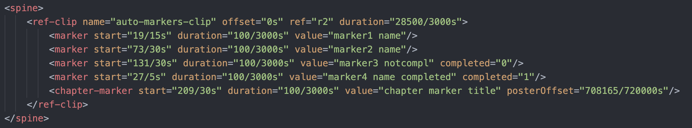
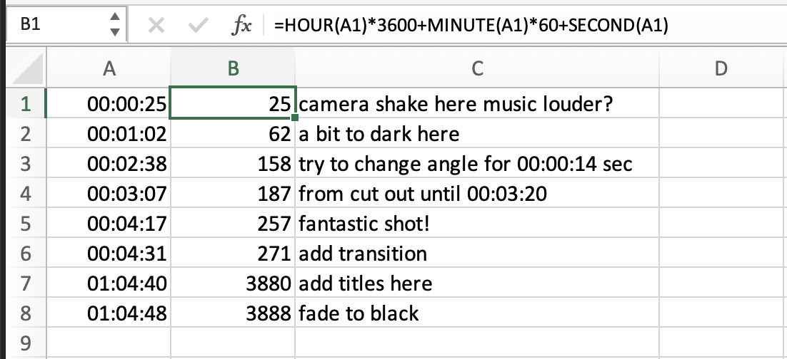
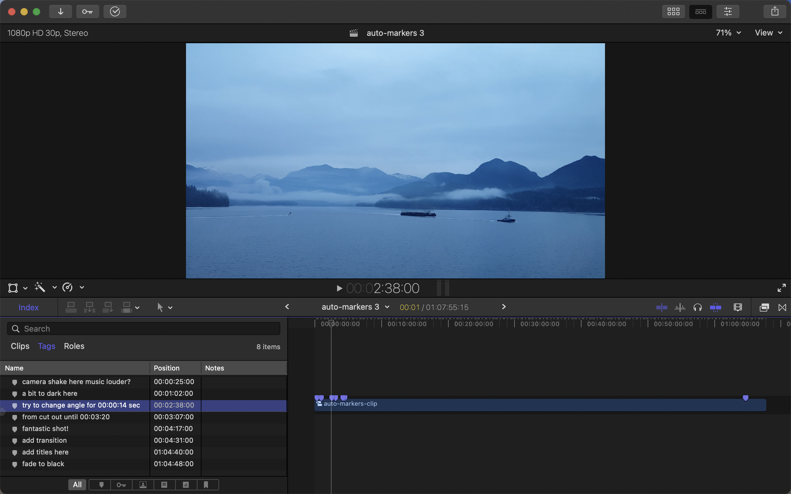

# Text_to_Video_Markers
## Objective
## Result
## Introduction



```
0:25 camera shake here
music louder? 
01:2 a bit to dark here
2:38 try to change angle for 0:14 sec
from 03:07 cut out until 3:20 
04:17 fantastic shot!
4:31 add transition
1:4:40 add titles here
01:04:48 fade to black

```

```
<spine>
    <ref-clip name="auto-markers-clip" offset="0s" ref="r2" duration="28500/3000s">
        <marker start="19/15s" duration="100/3000s" value="marker1 name"/>
        <marker start="73/30s" duration="100/3000s" value="marker2 name"/>
        <marker start="131/30s" duration="100/3000s" value="marker3 notcompl" completed="0"/>
        <marker start="27/5s" duration="100/3000s" value="marker4 name completed" completed="1"/>
        <chapter-marker start="209/30s" duration="100/3000s" value="chapter marker title" posterOffset="708165/720000s"/>
    </ref-clip>
</spine>
```

Finds timecode and wrap with special symbols "~" and "#"

```
FIND: (\d{1,2}:\d{1,2}:\d{1,2}|\d{1,2}:\d{1,2})
REPLACE: ~$1#
```
**Output**

```
~0:25# camera shake here
music louder? 
~01:2# a bit to dark here
~2:38# try to change angle for ~0:14# sec
from ~03:07# cut out until ~3:20# 
~04:17# fantastic shot!
~4:31# add transition
~1:4:40# add titles here
~01:04:48# fade to black
```

Add '00' hours

```
FIND: (~)(\d{1,2}:\d{1,2}\#)
REPLACE: $100:$2
```
**Output**

```
~00:0:25# camera shake here
music louder? 
~00:01:2# a bit to dark here
~00:2:38# try to change angle for ~00:0:14# sec
from ~00:03:07# cut out until ~00:3:20# 
~00:04:17# fantastic shot!
~00:4:31# add transition
~1:4:40# add titles here
~01:04:48# fade to black
```

Add 0 to single digit hours

```
FIND: (~)(\d:\d{1,2}:\d{1,2}\#)
REPLACE: $10$2
```
**Output:**

```
~00:0:25# camera shake here
music louder? 
~00:01:2# a bit to dark here
~00:2:38# try to change angle for ~00:0:14# sec
from ~00:03:07# cut out until ~00:3:20# 
~00:04:17# fantastic shot!
~00:4:31# add transition
~01:4:40# add titles here
~01:04:48# fade to black
```
Add 0 to single digit minutes

```
FIND: (~\d{1,2}:)(\d:\d{1,2}#)
REPLACE: $10$2
```
**Output:**

```
~00:00:25# camera shake here
music louder? 
~00:01:2# a bit to dark here
~00:02:38# try to change angle for ~00:00:14# sec
from ~00:03:07# cut out until ~00:03:20# 
~00:04:17# fantastic shot!
~00:04:31# add transition
~01:04:40# add titles here
~01:04:48# fade to black
```
Add 0 to single digit seconds

```
FIND: (~\d{1,2}:\d{1,2}:)(\d#)
REPLACE: $10$2
```
**Output:**

```
~00:00:25# camera shake here
music louder? 
~00:01:02# a bit to dark here
~00:02:38# try to change angle for ~00:00:14# sec
from ~00:03:07# cut out until ~00:03:20# 
~00:04:17# fantastic shot!
~00:04:31# add transition
~01:04:40# add titles here
~01:04:48# fade to black
```

Find lines of text without timecode and move it to the line above

```
FIND:(\D*)\n(\D*\n)
REPLACE: $1 $2
```
```
~00:00:25# camera shake here music louder? 
~00:01:02# a bit to dark here
~00:02:38# try to change angle for ~00:00:14# sec
from ~00:03:07# cut out until ~00:03:20# 
~00:04:17# fantastic shot!
~00:04:31# add transition
~01:04:40# add titles here
~01:04:48# fade to black
```

Find non digit characters at the beginning of the line and move them past the first timecode, while removing most of `~`, `#` characters and separating timecode and text with `tab`

```
FIND:(^\D*)(~)(\d{2}:\d{2}:\d{2})(# )(.*)
REPLACE: $3	$1$5
```
```
00:00:25	camera shake here music louder? 
00:01:02	a bit to dark here
00:02:38	try to change angle for ~00:00:14# sec
00:03:07	from cut out until ~00:03:20# 
00:04:17	fantastic shot!
00:04:31	add transition
01:04:40	add titles here
01:04:48	fade to black
```

Remove remaining `~`, `#` symbols

```
FIND: ~|#
REPLACE:
```
```
00:00:25	camera shake here music louder? 
00:01:02	a bit to dark here
00:02:38	try to change angle for 00:00:14 sec
00:03:07	from cut out until 00:03:20 
00:04:17	fantastic shot!
00:04:31	add transition
01:04:40	add titles here
01:04:48	fade to black
```


`=HOUR(A1)*3600+MINUTE(A1)*60+SECOND(A1)`

```
25	camera shake here music louder? 
62	a bit to dark here
158	try to change angle for 00:00:14 sec
187	from cut out until 00:03:20 
257	fantastic shot!
271	add transition
3880	add titles here
3888	fade to black
```
```
FIND:(\d*)	(.*)
REPLACE: <marker start="$1s" duration="100/3000s" value="$2"/>
```
```
<marker start="25s" duration="100/3000s" value="camera shake here music louder? "/>
<marker start="62s" duration="100/3000s" value="a bit to dark here"/>
<marker start="158s" duration="100/3000s" value="try to change angle for 00:00:14 sec"/>
<marker start="187s" duration="100/3000s" value="from cut out until 00:03:20 "/>
<marker start="257s" duration="100/3000s" value="fantastic shot!"/>
<marker start="271s" duration="100/3000s" value="add transition"/>
<marker start="3880s" duration="100/3000s" value="add titles here"/>
<marker start="3888s" duration="100/3000s" value="fade to black"/>
```



